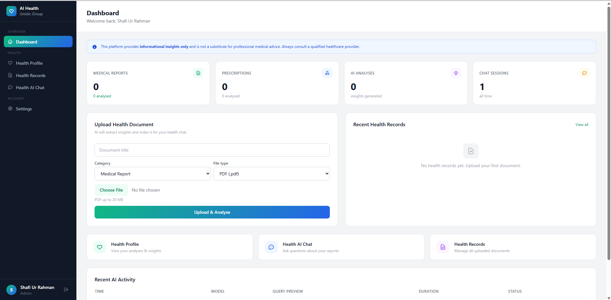
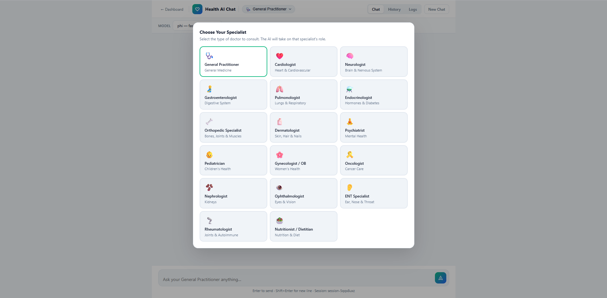
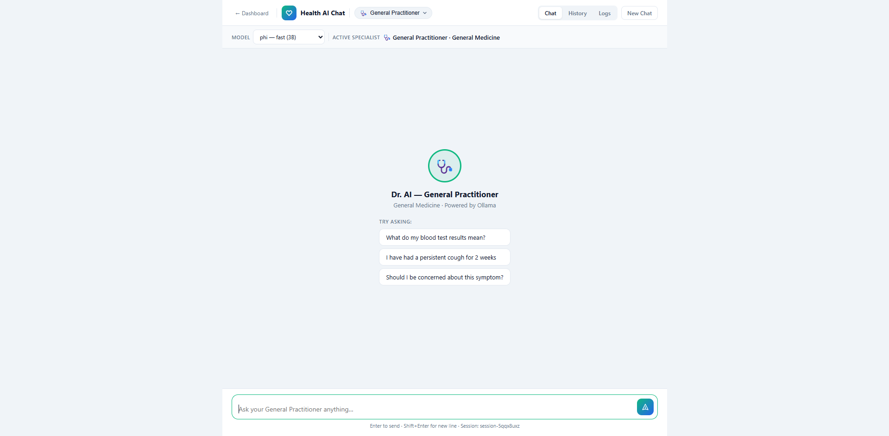
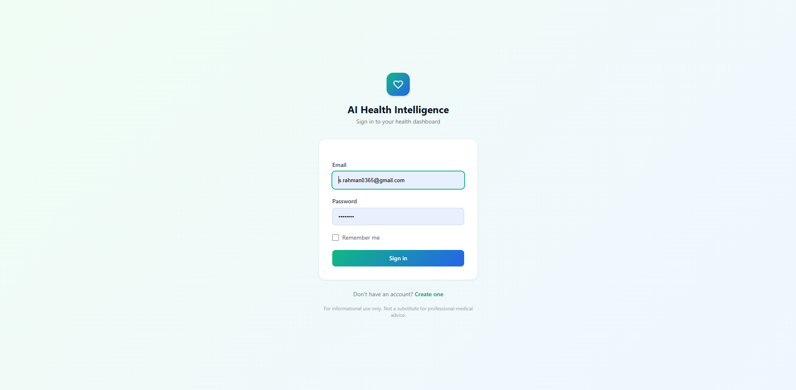
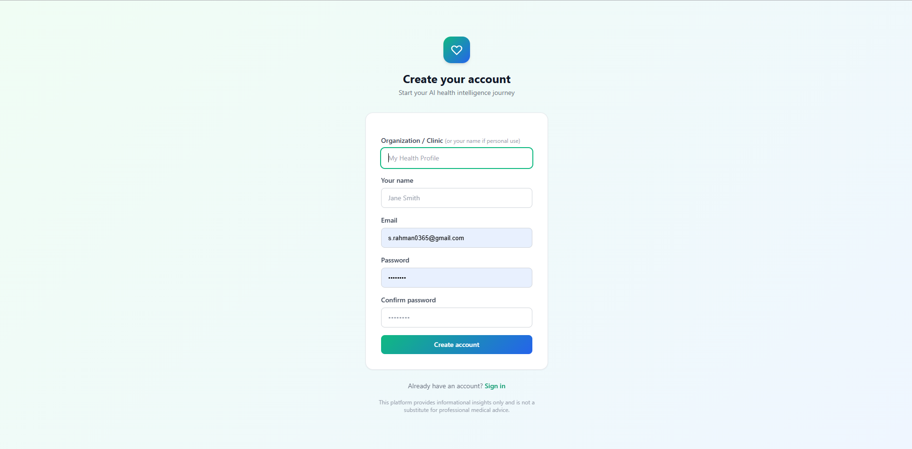

# AI Health Intelligence

> A self-hosted, privacy-first AI health platform built on Laravel 12, Ollama, and Qdrant.
> Local inference. No cloud dependency. No data leaves your machine.

[](https://php.net)
[](https://laravel.com)
[](https://ollama.com)
[](https://qdrant.tech)
[](LICENSE)
[]()

---

## Why This Exists

Most AI health tools are cloud-dependent: documents uploaded to third-party servers, inferences run on remote APIs, and no control over data residency. This platform takes the opposite position — all inference runs locally through Ollama, all vector storage is self-hosted in Qdrant, and the only network requests are the ones you configure.

The goal was to build a production-grade RAG pipeline for a sensitive domain (medical data) where privacy is non-negotiable, and to do it without sacrificing capability: structured extraction, hybrid retrieval, streaming responses, specialist role framing, and shareable profile generation all work offline.

---

## Architecture

```
┌──────────────────────────────────────────────────────────────────┐
│                         Request Layer                            │
│              Browser  ──  Blade SPA  ──  REST API                │
└────────────────────────────┬─────────────────────────────────────┘
                             │
┌────────────────────────────▼─────────────────────────────────────┐
│                      Laravel 12 Core                             │
│                                                                  │
│   Auth (Sanctum)  │  Queue (DB driver)  │  Rate Limiting         │
│   Tenant Scope    │  Event Pipeline     │  Middleware Stack       │
└────────┬──────────────────────┬─────────────────────────────────-┘
         │                      │
         │ HTTP           Queue Jobs
         │                      │
┌────────▼──────────┐  ┌────────▼────────────────────────────────-─┐
│   AIManager       │  │         Background Processing              │
│   (Orchestrator)  │  │                                            │
│                   │  │  ProcessDocumentJob                        │
│  ┌─────────────┐  │  │   └─ text extraction (PDF / OCR)          │
│  │ OllamaProvider│ │  │   └─ chunk + embed via EmbeddingService   │
│  │ (LLM client)│  │  │   └─ upsert vectors to Qdrant             │
│  └──────┬──────┘  │  │                                            │
│         │         │  │  AnalyzeMedicalDocumentJob                 │
│  ┌──────▼──────┐  │  │   └─ structured prompt construction        │
│  │EmbeddingService│ │  │   └─ LLM analysis (findings, risk, meds) │
│  │(nomic-embed)│  │  │   └─ persist structured JSON to DB         │
│  └──────┬──────┘  │  └─────────────────────────────────────────--┘
└─────────┼─────────┘
          │
┌─────────▼─────────────────────────────────────────────────────--─┐
│                      Qdrant (Vector Store)                       │
│   Collection: health_documents  │  Dim: 768  │  HNSW index       │
│   Payload filters by tenant_id + document_id for data isolation  │
└──────────────────────────────────────────────────────────────────┘
```

### Architecture Decisions

**Why Ollama instead of a hosted API?**
Medical documents are sensitive. Running inference locally eliminates a class of privacy and compliance concerns at the architecture level. Ollama also allows swapping models without code changes — the provider abstraction in `AIManager` means you can route to OpenAI or any other provider by adding a driver without touching application logic.

**Why Qdrant over pgvector?**
Qdrant supports native payload filtering on vector search, which is critical for multi-tenant isolation — we filter by `tenant_id` at query time so tenants cannot access each other's document vectors. pgvector would require application-level filtering, which is a correctness risk. Qdrant's HNSW index also scales better when document volume grows.

**Why a queue-based processing pipeline?**
Document processing involves text extraction, chunking, embedding generation, and LLM analysis — sequential blocking operations that can take 15–90 seconds per document depending on model and hardware. Decoupling this to a background queue means the upload endpoint is always fast, retries are automatic on failure, and processing can scale horizontally by adding queue workers without touching the web layer.

**Why the database queue driver (no Redis)?**
For a self-hosted deployment, requiring Redis introduces operational complexity. The database driver works reliably at this scale, and switching to Redis is a one-line `.env` change when throughput demands it.

---

## Processing Lifecycle

```
Document Upload (POST /api/v1/documents)
    │
    ├─ Store file to disk (local / S3-compatible)
    ├─ Create Document record (status: pending)
    └─ Dispatch ProcessDocumentJob + AnalyzeMedicalDocumentJob to queue

ProcessDocumentJob
    │
    ├─ Extract text:
    │     PDF → pdfparser  |  Image → Tesseract OCR
    ├─ Chunk text (sliding window, ~500 tokens per chunk)
    ├─ Generate 768-dim embeddings via nomic-embed-text
    └─ Upsert to Qdrant with metadata: {tenant_id, document_id, chunk_index}

AnalyzeMedicalDocumentJob
    │
    ├─ Build structured extraction prompt from raw text
    ├─ Route to OllamaProvider → LLM inference
    ├─ Parse structured JSON response:
    │     MedicalReport  →  findings, risk_level, concerns, recommendations
    │     Prescription   →  medicines[{name, dosage, frequency, purpose, warnings}]
    └─ Persist to analysis JSON column on Document record (status: analyzed)

Chat Request (POST /api/v1/chat/sse)
    │
    ├─ Embed user query via EmbeddingService
    ├─ Query Qdrant (top-k=5, filtered by tenant_id)
    ├─ Build context-augmented prompt:
    │     system: specialist doctor role (17 available)
    │     context: retrieved document chunks
    │     history: last N conversation turns
    └─ Stream response tokens back to client via SSE
```

---

## Core Services

| Service | Responsibility |
|---|---|
| `AIManager` | RAG orchestration — routes queries, injects context, manages provider selection |
| `OllamaProvider` | Ollama API client — chat completion, streaming, configurable model selection |
| `EmbeddingService` | Generates 768-dim vectors using nomic-embed-text |
| `QdrantService` | Vector store client — upsert, similarity search, collection management |
| `MedicalAnalyzerService` | Structured prompt engineering for medical report extraction |
| `PrescriptionAnalyzerService` | Structured prompt engineering for prescription parsing |
| `HealthRecommendationService` | Generates personalised diet/lifestyle/exercise plans from document context |

---

## Features

**Medical Report Analyzer**
Uploads PDF or image reports. Extracts key findings, risk classification, concerns, and actionable recommendations using structured LLM prompting. Output is persisted as structured JSON for downstream queries.

**Prescription Analyzer**
Parses prescriptions into individual medicine cards: name, dosage, frequency, purpose, and warnings. Handles multi-medicine prescriptions with per-item structured output.

**Health Recommendation Engine**
Cross-references all of a user's documents to generate personalised diet, lifestyle, exercise, and daily routine plans. Recommendations are regenerated on new document upload.

**AI Health Chat**
RAG-powered conversational interface with 17 specialist doctor roles (Cardiologist, Neurologist, Oncologist, Endocrinologist, and others). Role framing shapes system prompt behaviour. Model is selectable per session. Responses stream via SSE with mid-stream cancellation.

**Shareable Health Profile**
Generates a time-limited signed token link to a read-only health summary. Useful for sharing a snapshot with a treating physician without giving full account access.

**Multi-tenant Isolation**
All document storage, vector search, AI analysis, and conversation history are scoped to `tenant_id`. Qdrant payload filters enforce this at the retrieval layer, not just the application layer.

**Provider Abstraction**
`config/ai.php` defines a driver-based provider system. OpenAI is stubbed as a future provider. Adding a new LLM backend requires implementing a single interface and registering it in config — no application logic changes.

---

## Screenshots

### Dashboard
<p align="center">
  
</p>

### Health AI Chat — Specialist Selection
<p align="center">
  
</p>

### Health AI Chat — Conversation
<p align="center">
  
</p>

<details>
<summary>Login & Register</summary>
<p align="center">
  
  &nbsp;
  
</p>
</details>

---

## Requirements

| Dependency | Version | Notes |
|---|---|---|
| PHP | 8.2+ | Extensions: `pdo_mysql`, `mbstring`, `fileinfo`, `curl`, `zip` |
| Composer | 2.x | |
| MySQL | 8.0+ | Or MariaDB 10.6+ |
| Node.js | 18+ | Only if rebuilding assets (TailwindCSS via CDN by default) |
| Ollama | latest | [ollama.com](https://ollama.com) — runs LLMs locally |
| Qdrant | 1.7+ | Vector DB — single Docker command |
| Tesseract OCR | 5.x | Optional — only for image-format prescriptions |

---

## Model Configuration

### Required

```bash
# Embedding model — required for all document indexing
ollama pull nomic-embed-text

# Chat models — pull at least one
ollama pull phi          # ~2 GB  · Fastest  · Good for quick answers
ollama pull llama3       # ~5 GB  · Balanced · Recommended default
ollama pull gemma4       # ~5 GB  · Best quality · Deeper analysis
```

### Model Comparison

| Model | Size | Speed | Quality | Recommended For |
|---|---|---|---|---|
| `phi` | ~2 GB | Fast | Good | Quick questions, low-spec hardware |
| `llama3` | ~5 GB | Medium | Very Good | General use — default |
| `gemma4` | ~5 GB | Slower | Best | Detailed medical report analysis |
| `nomic-embed-text` | ~300 MB | Fast | — | Embeddings (required) |

### Optional Medical Models

```bash
ollama pull meditron      # 7B · Fine-tuned on medical literature
ollama pull medllama3     # 8B · Medical fine-tune of Llama 3
ollama pull mistral       # 7B · Strong general reasoning
ollama pull qwen2.5       # 7B · Multilingual support
```

The default model is set in `config/ai.php` and overridable per-session in Settings. Any Ollama-compatible model can be added to the model list in config without code changes.

---

## Installation

### 1. Clone

```bash
git clone https://github.com/shafi-rahman/ai-health-intelligence.git
cd ai-health-intelligence/laravel-app
```

### 2. PHP Dependencies

```bash
composer install
```

### 3. Environment

```bash
cp .env.example .env
php artisan key:generate
```

### 4. Database

```env
DB_CONNECTION=mysql
DB_HOST=127.0.0.1
DB_PORT=3306
DB_DATABASE=ai_health_intelligence
DB_USERNAME=root
DB_PASSWORD=your_password
```

```sql
CREATE DATABASE ai_health_intelligence CHARACTER SET utf8mb4 COLLATE utf8mb4_unicode_ci;
```

```bash
php artisan migrate
```

### 5. Start Qdrant

```bash
docker run -d --name qdrant -p 6333:6333 qdrant/qdrant

# Verify
curl http://localhost:6333/
# → {"title":"qdrant - vector search engine","version":"..."}
```

The `health_documents` collection is created automatically on first document upload.

### 6. Start Ollama and Pull Models

```bash
# Install from https://ollama.com, then:
ollama pull nomic-embed-text
ollama pull llama3
```

Ollama serves on `http://localhost:11434` by default.

### 7. Tesseract (Optional — image OCR)

Only needed for image-format prescriptions (JPG/PNG/WebP).

```bash
# macOS
brew install tesseract

# Linux
sudo apt install tesseract-ocr

# Windows — download from https://github.com/UB-Mannheim/tesseract/wiki
# Add C:\Program Files\Tesseract-OCR to PATH
```

---

## Running Locally

Two processes must run simultaneously: the web server and the queue worker.

```bash
# Recommended — starts both via concurrently
composer run dev
```

Or separately:

```bash
# Terminal 1
php artisan serve

# Terminal 2 — required for document processing
php artisan queue:listen --tries=1 --timeout=0
```

Open `http://127.0.0.1:8000`.

### System Health Check

```bash
curl http://127.0.0.1:8000/api/health-check
# → {"status":"ok","ollama":"reachable","time":"..."}
```

---

## First Use

1. Register at `/register`
2. Upload a medical report from the Dashboard — select category `Medical Report`
3. The queue worker processes it: text extraction → embedding → vector indexing → AI analysis
4. View structured findings in **Health Records**
5. Go to **Health Profile** for personalised recommendations
6. Open **Health AI Chat** → select a specialist role → start a context-aware conversation

---

## API Reference

All authenticated routes require `Authorization: Bearer <token>`.

### Auth

| Method | Endpoint | Description |
|---|---|---|
| `POST` | `/api/v1/auth/register` | Register |
| `POST` | `/api/v1/auth/login` | Obtain API token |
| `POST` | `/api/v1/auth/logout` | Revoke token |
| `GET` | `/api/v1/auth/me` | Authenticated user |

### Documents

| Method | Endpoint | Description |
|---|---|---|
| `GET` | `/api/v1/documents` | List documents |
| `POST` | `/api/v1/documents` | Upload document |
| `GET` | `/api/v1/documents/{id}` | Document detail |
| `GET` | `/api/v1/documents/{id}/analysis` | Structured analysis JSON |
| `POST` | `/api/v1/documents/{id}/reprocess` | Re-run analysis |
| `DELETE` | `/api/v1/documents/{id}` | Delete document + vectors |

### Health Profile & Chat

| Method | Endpoint | Description |
|---|---|---|
| `GET` | `/api/v1/health-profile` | Full health profile |
| `GET` | `/api/v1/health-profile/recommendations` | Personalised recommendations |
| `POST` | `/api/v1/health-profile/share` | Generate shareable token |
| `GET` | `/api/share/{token}` | Public view (no auth) |
| `POST` | `/api/v1/chat/sse` | Streaming chat (SSE) |

### System

| Method | Endpoint | Description |
|---|---|---|
| `GET` | `/api/health-check` | Ollama reachability check |

Rate limit: 120 requests/minute per authenticated user. Widget endpoint: 60 requests/minute.

---

## Project Structure

```
laravel-app/
├── app/
│   ├── Http/
│   │   ├── Controllers/
│   │   │   ├── Web/                        # Blade page controllers
│   │   │   │   ├── DashboardController.php
│   │   │   │   ├── DocumentsController.php
│   │   │   │   └── HealthProfileWebController.php
│   │   │   ├── Admin/
│   │   │   │   └── DocumentController.php  # REST API — documents
│   │   │   ├── AIController.php            # Chat + SSE streaming
│   │   │   ├── HealthProfileController.php
│   │   │   ├── ConversationController.php  # Admin: AI logs
│   │   │   ├── ShareableReportController.php
│   │   │   └── WidgetController.php        # Embeddable widget endpoint
│   │   └── Middleware/
│   ├── Services/
│   │   ├── AI/
│   │   │   ├── AIManager.php               # RAG orchestration layer
│   │   │   ├── EmbeddingService.php        # nomic-embed-text client
│   │   │   └── Providers/
│   │   │       └── OllamaProvider.php      # Ollama API adapter
│   │   ├── Health/
│   │   │   ├── MedicalAnalyzerService.php
│   │   │   ├── PrescriptionAnalyzerService.php
│   │   │   └── HealthRecommendationService.php
│   │   └── Qdrant/
│   │       └── QdrantService.php           # Vector store client
│   ├── Jobs/
│   │   ├── ProcessDocumentJob.php          # Chunk + embed + index
│   │   └── AnalyzeMedicalDocumentJob.php   # LLM structured analysis
│   └── Models/
│       ├── Document.php
│       ├── Conversation.php
│       ├── ShareableReport.php
│       └── Tenant.php
├── config/
│   ├── ai.php                              # Provider config, model list, prompts
│   └── qdrant.php                          # Vector store config
└── resources/views/
    ├── layouts/app.blade.php
    ├── dashboard.blade.php
    ├── health-profile.blade.php
    ├── documents.blade.php
    ├── chat.blade.php
    └── settings.blade.php
```

---

## Extending the Platform

### Adding an LLM Provider

1. Implement `App\Services\AI\Providers\ProviderInterface` (or follow `OllamaProvider` as the reference)
2. Register the driver in `config/ai.php` under `providers`
3. Set `AI_PROVIDER=your-provider` in `.env`

No changes to `AIManager` or any application logic are needed.

### Adding a Specialist Role

Specialist roles are defined as a keyed array in `config/ai.php` (system prompt per role). Adding a new role requires adding one entry to that array — it appears automatically in the chat UI.

### Changing the Embedding Model

Update `OLLAMA_EMBEDDING_MODEL` in `.env` and ensure the `QDRANT_VECTOR_SIZE` matches the new model's output dimensions. The `EmbeddingService` is stateless and picks up the config on every request — no code changes needed.

### Scaling the Queue

The queue driver defaults to `database`. To scale:

1. Switch to Redis: `QUEUE_CONNECTION=redis` in `.env`
2. Run multiple workers: `php artisan queue:work --queue=documents,default`
3. Use Laravel Horizon for visibility and worker autoscaling

---

## Scalability Considerations

**Current Constraints**

- Embedding generation is CPU/GPU-bound on the Ollama host. High document volume will queue up on a single machine.
- The database queue driver serialises job dispatch under high concurrency. Redis removes this bottleneck.
- Qdrant runs as a single node in the default Docker setup. For production scale, Qdrant supports distributed cluster mode.

**Horizontal Scaling Path**

```
Queue workers  →  scale independently (add workers, no shared state)
Web layer      →  stateless (Sanctum tokens in DB) — add instances behind a load balancer
Qdrant         →  shard collections by tenant at high volume
Ollama         →  GPU host isolation, or swap to a hosted provider via the provider abstraction
```

**Token / Context Budgeting**

`OLLAMA_NUM_CTX` (default 4096) and `OLLAMA_NUM_PREDICT` (default 1024) are configurable per deployment. For detailed medical report analysis, consider increasing `NUM_CTX` to 8192 on capable hardware. Context overflow will truncate retrieved document chunks, which degrades RAG quality — monitor chunk count vs. context window at scale.

---

## Security Notes

- All document access is scoped to authenticated `tenant_id` — cross-tenant access is architecturally impossible via the API
- Qdrant payload filters enforce tenant isolation at the vector retrieval layer (not just application-level)
- Shareable report tokens are signed, time-limited, and grant read-only access to a single summary view
- The widget endpoint uses per-IP rate limiting to prevent abuse
- No medical data is transmitted to external services in the default configuration
- File uploads are validated for MIME type and stored outside the public webroot

---

## AI-Assisted Development

This platform was designed and engineered by a senior PHP/Laravel developer. AI tooling (Claude) was used throughout the development workflow as an accelerator and review layer.

**What AI contributed:**
- Boilerplate generation from clearly-specified interfaces (service stubs, migration scaffolding)
- Code review passes on prompt engineering logic
- Documentation drafting against an existing architecture
- Rubber-ducking on edge cases in the RAG pipeline (chunk overlap strategy, context window budgeting)

**What remained human-led:**
- System architecture design (provider abstraction, tenant isolation model, queue topology)
- Engineering tradeoffs (Qdrant vs pgvector, database queue vs Redis, local vs hosted inference)
- Security model (where isolation is enforced, why at the vector layer)
- Prompt engineering for structured medical extraction
- All final review, validation, and integration decisions

The codebase reflects engineering decisions made by a developer with 12+ years of PHP/Laravel experience. AI is a tool in the workflow — not the engineer.

---

## Development Timeline

Project start: **April 18, 2025**

| Phase | Scope | Status |
|---|---|---|
| Phase 1 | Multi-tenant auth, document upload, queue pipeline, Qdrant indexing | Complete |
| Phase 2 | Medical report + prescription structured analysis | Complete |
| Phase 3 | Health recommendation engine, health profile | Complete |
| Phase 4 | AI chat with 17 specialist roles, SSE streaming, model switching | Complete |
| Phase 5 | Shareable health profile, embeddable widget | Complete |
| Phase 6 | Admin observability (conversation logs, AI audit trail) | In progress |
| Phase 7 | Additional provider support (OpenAI, Groq), provider routing | Planned |
| Phase 8 | Appointment tracking, medication reminders | Planned |

---

## Roadmap

- [ ] Redis queue driver for production deployments
- [ ] Per-document context budget management
- [ ] Conversation memory with sliding window summarisation
- [ ] OpenAI/Groq provider driver via existing abstraction
- [ ] Admin dashboard: processing metrics, queue depth, AI latency
- [ ] Webhook support for document processing completion events
- [ ] S3-compatible file storage backend
- [ ] Rate limiting per tenant (not just per IP)
- [ ] Docker Compose for full-stack local setup

---

## Environment Variables Reference

```env
# Application
APP_NAME="AI Health Intelligence"
APP_URL=http://localhost

# Database
DB_CONNECTION=mysql
DB_DATABASE=ai_health_intelligence
DB_USERNAME=root
DB_PASSWORD=

# Queue — switch to redis for production
QUEUE_CONNECTION=database

# Ollama
OLLAMA_URL=http://localhost:11434/api/chat
OLLAMA_EMBEDDING_MODEL=nomic-embed-text
OLLAMA_NUM_CTX=4096        # Context window — increase for longer documents
OLLAMA_NUM_PREDICT=1024    # Max tokens per LLM response

# Qdrant
QDRANT_URL=http://localhost:6333
QDRANT_COLLECTION=health_documents
QDRANT_VECTOR_SIZE=768     # Must match embedding model output dimensions
```

---

## Medical Disclaimer

This application is for **informational and educational purposes only**. AI-generated health information is not a substitute for professional medical advice, diagnosis, or treatment. Always consult a qualified healthcare provider.

---

## Author

**Shafi Ur Rahman** — Senior PHP / Laravel Engineer

[](https://www.linkedin.com/in/shafirahman-com/)

---

## License

MIT — free to use, modify, and distribute.
